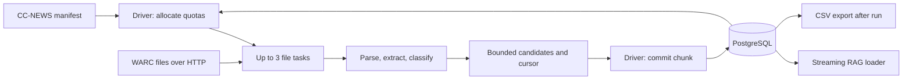

# Architecture

The pipeline separates parallel article processing from transactional database
writes. Spark workers download, extract, and classify; the driver schedules work
and owns all PostgreSQL writes.

[Usage and configuration](../README.md) · [Validation results](validation.md)

## Data flow

A **wave** is a bounded set of file tasks executed concurrently. A **chunk** is one
task's result: qualifying candidates, the next source offset, and processing
statistics. The driver waits for the wave to finish, commits its chunks, then
schedules the next wave from persisted state.

## Quota enforcement

The driver assigns each task a candidate allowance constrained by its file's
remaining quota. Allowances across the wave never exceed the remaining global
target. Workers may return fewer candidates when they reach EOF or a resource limit.

PostgreSQL decides which candidates are new using the unique WARC record ID and
`ON CONFLICT DO NOTHING RETURNING`. Only articles whose page, metadata, and content
commit successfully count toward quotas. Duplicates and rejected rows leave room
for subsequent waves. Per-file quotas apply within a run.

## Worker processing

Each task streams from a saved compressed offset and processes records through:

1. **Parsing:** FastWARC reads record boundaries; gzip validation checks integrity.
2. **Extraction:** decode HTML, preserve author/date metadata, then extract main
   content with trafilatura or fall back to selectolax.
3. **Filtering:** enforce size and word limits, classify with Lingua, and retain
   Arabic, English, or French articles that pass the script checks.
4. **Result assembly:** return candidates within the assigned count and byte limits,
   plus a cursor and counters. A candidate that would overflow the result buffer
   is revisited by the next task.

Python workers reuse a cached 20-language detector. Language samples cover the
beginning, middle, and end of the article. Saved provenance includes the source
file, WARC date, and extraction method; Arabic dialect is left unknown.

## Transactions and recovery

A session advisory lock allows **one ingestion coordinator per database**. The
driver reuses that connection and commits each chunk as one transaction containing
article rows, quota counters, file state, and a chunk receipt. `DB_BATCH_SIZE`
controls SQL batch size within that transaction.

If a commit acknowledgement is lost, a retry checks the receipt before inserting
again. Savepoints isolate malformed rows, with JSONL diagnostics written to
`dead_letter/` (configurable through `DEAD_LETTER_DIR`). Persistent failures stop
the run; failed chunks cannot advance the source cursor.

Resume restores persisted quotas and filtering settings and makes failed files
eligible for retry. Operational budgets may change. File states distinguish
`pending`, `quota_reached`, `eof`, and `failed`; run states distinguish `running`,
`complete`, `shortfall`, and `failed`.

Source checkpoints use compressed record boundaries. HTTP Range and available
source validators are checked; a server that ignores Range requires replay to the
saved boundary. Only validated EOF exhausts a source. Resume requires one WARC
record per gzip member. Legacy completed checkpoints are preserved, while legacy
partial offsets restart from zero.

## Memory bounds

Count limits are combined with byte limits. At the defaults, each task returns at
most 4 MiB of candidate JSON payload and a three-task wave returns approximately
12 MiB, plus serialization and result metadata. Decoded HTML is limited to 4 MiB;
an individual serialized article is limited to 1 MiB. Oversized records are skipped.

These are payload bounds, not total process-memory limits. HTML trees, language
models, Python, and the JVM require additional memory. Input/time budgets are
checked between records, so a record, lookahead, or replayed prefix can exceed them.

The launcher uses one core per executor, one native/model compute thread per
worker, fixed executor allocation, and a 64 MiB driver result limit. Chunk statistics
record Python peak RSS, processing time, bytes, and rejection counts. Full container
memory must be assessed through cluster metrics.

## Storage and deployment

| Tables | Responsibility |
|---|---|
| `websites`, `authors` | Shared article attributes |
| `pages`, `metadata`, `content` | Article identity, descriptive fields, and text |
| `ingest_runs`, `ingest_run_files` | Saved configuration, quotas, per-file progress |
| `ingest_chunks` | Commit receipts and task statistics |
| `ingest_files` | Source checkpoints shared across runs |
| `ingest_schema_versions` | Applied schema migrations |
| `article_chunks`, `chunk_materializations` | Versioned chunk text and materialization receipts |
| `chunk_analyses` | Versioned analysis outcomes attached to chunks |
| `chunk_embeddings` | Versioned pgvector vectors attached to chunks |

The launcher packages Python dependencies and project modules for YARN. Environment
and Spark-jar fingerprints select reusable archives on HDFS; temporary uploads are
renamed into place. Code is packaged each launch. Local archives and packaging workspaces live in
`.build-tmp/`. Shared archives are retained until
manual maintenance removes unused versions.

## Module boundaries

Post-ingestion processing has independent Spark jobs for chunking, tagging, and
embedding, sharing bounded concurrent task submission in `jobs`.
The driver reads PostgreSQL and commits completed batches; executors clean/split
or run a batch analyzer. See [processing and recovery](processing.md).

The application uses top-level feature packages. Run Python module commands from
the project root; no editable install or extra source path is needed. Spark's
`--py-files` archive contains `ingestion/`, `db/`, `chunking/`, `tagging/`, and `jobs/`, preserving the
same imports on workers. The launcher resolves the project root itself and can
be invoked from another directory.

- **ingestion** coordinates Spark and transforms WARC records into article rows.
  It uses `db` but does not import chunking or optional RAG dependencies.
- **db** owns connections, schema, writes, ingestion checkpoints, and inspection.
  Its `documents.py` module streams stored articles as LangChain Documents while
  retaining source metadata and cursor cleanup.
- **chunking** contains pure cleaning/splitting helpers and a separate Spark
  coordinator. Splitters accept Documents and preserve provenance; the coordinator
  uses `db.chunks` for source selection and transactional materialization.
- **tagging** defines a provider-independent batch contract, optional backend
  adapters, and a Spark coordinator using `db.analyses` for persistence.
- **jobs** supplies bounded batch packing, concurrent Spark submission, and CLI
  runtime helpers. All three pipelines share Spark startup and task submission;
  ingestion retains its own task allocation and transactional wave scheduling.
  The three shell launchers share packaging through `scripts/run_processing.sh`.

Create `retrieval/` when indexing, search, or ranking code is added. Keep backend
adapters with that feature and compose stages at their entry points. Package
imports should not open connections, load models, or run jobs.

Keep optional dependencies separate from ingestion requirements. Add new tests
under `tests/`; put operational launchers in `scripts/`. The ingestion module
retains its configuration and scheduling logic to preserve behavior during this
structural change.

Ingestion **chunks** are bounded worker results and commit receipts. RAG text
**chunks** are document fragments produced by `chunking`; these are distinct concepts.

## Code map

| File | Responsibility |
|---|---|
| [ingestion/pipeline.py](../ingestion/pipeline.py) | Configuration, scheduling, workers, progress, and run lifecycle |
| [db/db_handler.py](../db/db_handler.py) | Schema, locking, inserts, and durable ingestion state |
| [ingestion/warc.py](../ingestion/warc.py) | Streaming WARC parsing and gzip validation |
| [ingestion/extraction.py](../ingestion/extraction.py) | Article text, metadata, and language detection |
| [ingestion/text.py](../ingestion/text.py) | Encoding and language validation |
| [scripts/run_ingestion.sh](../scripts/run_ingestion.sh), [scripts/ingest.py](../scripts/ingest.py) | Packaging and YARN submission |
| [db/documents.py](../db/documents.py) | Streaming database documents |
| [chunking/splitters.py](../chunking/splitters.py) | Incremental document splitting |
| [scripts/inspect_db.sh](../scripts/inspect_db.sh), [scripts/export_csv.sh](../scripts/export_csv.sh) | Inspection and post-run CSV export |

Extraction can leave residual site boilerplate. Downstream RAG processing may need
to filter repetitive footer or subscription text before indexing.
