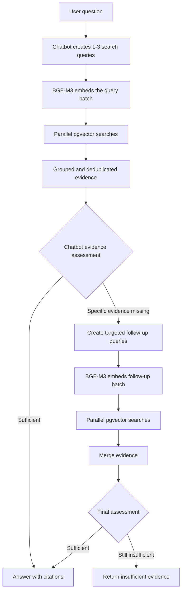

# Retrieval and Chatbot Design

This document records the agreed design for connecting vector retrieval to the
separate chatbot answering module. It is an implementation guide, not a description
of functionality that already exists.

## Decisions

- Retrieval is vector-only. Do not add keyword search, BM25, PostgreSQL full-text
  search, `LIKE`, `ILIKE`, `tsvector`, or keyword-derived score adjustments.
- The retrieval service returns ranked evidence and provenance. The separate
  chatbot module generates answers.
- Do not put an LLM intent router in front of every search.
- Do not implement rule-based query decomposition. It becomes brittle across
  Arabic, English, and French and attempts to decide what evidence is needed before
  seeing the first retrieval result.
- The chatbot may produce one to three self-contained semantic search queries. It
  can decompose a multi-part question when useful.
- The chatbot may request one additional retrieval round after identifying the
  specific evidence that is missing.
- Use ordinary Python and `asyncio` for the initial bounded workflow. LangGraph is
  deferred until durable checkpoints, human approval, multiple tools, or more
  complicated loops justify it.
- Do not import the sibling fake retriever or its current retry loop. Repeating the
  same deterministic search without changing the query or search parameters is not
  corrective retrieval.

## Component responsibilities

### Retrieval service

The retrieval service is deterministic and does not decide user intent. It:

1. Accepts one to three search queries.
2. Embeds all queries in one batch with the existing BGE-M3 implementation.
3. Searches the versioned `chunk_embeddings` rows through pgvector.
4. Returns the top results for each query, preserving the query-to-result mapping.
5. Deduplicates repeated chunks while retaining every query that matched them.
6. Returns chunk text, similarity, stable chunk identity, URL, title, language,
   publisher, author, and publication date.

Every search must use the same model files, maximum token length, pooling,
normalization, `embedding_model`, and computed `embedding_version` used to create
the stored chunk vectors. Searches must also select the configured
`chunking_version` and eligible chunks only.

### Chatbot module

The chatbot owns semantic planning and answering. It:

1. Keeps the original user question unchanged in its state.
2. Produces one query for a simple question or up to three self-contained queries
   when separate evidence is required.
3. Examines the grouped evidence and either answers or names the missing aspects.
4. May request one targeted follow-up search round.
5. Generates an answer using returned evidence and cites stable chunk identifiers.
6. Reports insufficient evidence when the allowed retry still does not provide the
   required support.

The chatbot must not answer from an unsupported draft and then use its own prose as
the retrieval query. Follow-up queries must describe evidence missing from the
original question.

## Request flow



Keep results grouped by search query until the chatbot has checked coverage. A
single global ranking can allow an easy sub-question to consume every result and
leave another part without evidence.

## Model responsibilities

| Task | Mechanism |
|---|---|
| Query and chunk embeddings | Local BGE-M3 bi-encoder |
| Corpus candidate ranking | pgvector inner-product similarity |
| Query decomposition | Chatbot LLM, only when it chooses multiple searches |
| Missing-evidence analysis | Chatbot LLM after seeing retrieved chunks |
| Follow-up query generation | Chatbot LLM, at most one round |
| Answer generation | Separate chatbot LLM |
| Candidate reranking | Optional multilingual cross-encoder, added only after evaluation |
| Answer grounding | Optional multilingual NLI cross-encoder in the chatbot module |

A bi-encoder embeds queries and chunks independently, which makes corpus search
efficient. A reranking cross-encoder reads a query and candidate chunk together and
produces a more precise relevance score, but it requires one inference per pair.
If introduced, apply it only to a small pgvector candidate set, such as the top
10-30 results.

A grounding cross-encoder performs a different task. It reads an answer claim and
its cited evidence together and predicts entailment, neutrality, or contradiction.
It can determine whether the evidence supports the claim; it cannot establish that
the source itself is factually true. Reranking and grounding models are deferred
until labeled evaluations demonstrate a need.

## Tool contract without an orchestration framework

The chatbot's search tool is a JSON contract implemented by application code. No
agent framework is required.

```json
{
  "action": "search",
  "queries": [
    {
      "id": "comparison",
      "query": "differences between policy A and policy B",
      "purpose": "Find evidence comparing the policies"
    },
    {
      "id": "replacement_reason",
      "query": "why policy B replaced policy A",
      "purpose": "Find the reason for the replacement"
    }
  ]
}
```

After retrieval, the chatbot returns either an answer action or a targeted retry:

```json
{
  "action": "search_more",
  "reason": "The comparison is supported, but the replacement reason is missing.",
  "missing_aspects": ["Reason policy B replaced policy A"],
  "queries": [
    {
      "id": "replacement_reason_retry",
      "query": "stated reasons policy B replaced policy A",
      "purpose": "Find the missing replacement rationale"
    }
  ]
}
```

Define these actions as validated Pydantic models. The application invokes the
corresponding Python function, appends its result to the chatbot conversation, and
asks the chatbot for the next structured action. The model never receives database
credentials or executes code.

## Concurrency

For a batch of decomposed queries:

1. Call `generate_embeddings()` once with the full list. This is more efficient
   than starting one ONNX invocation per query.
2. Run the synchronous ONNX batch through `asyncio.to_thread()` so it does not
   block an asynchronous API event loop.
3. Start one pgvector search per query with `asyncio.gather()` or
   `asyncio.TaskGroup`.
4. Because the project currently uses synchronous `psycopg2`, run each search
   through `asyncio.to_thread()` and give it a separate connection from a
   `ThreadedConnectionPool`. Never share a connection or cursor between concurrent
   searches.
5. Bound database search concurrency with an `asyncio.Semaphore`.

Initial operational limits are:

```text
maximum queries per round:       3
maximum retrieval rounds:        2
maximum concurrent DB searches:  3
embedding inference concurrency: 1 batch per process
```

These limits must be enforced by application code rather than accepted from model
output. The service also controls `top_k`, timeouts, database filters, and permitted
metadata fields.

## Sibling implementation disposition

The sibling `query-ret-optimization` work is a prototype rather than a production
retrieval implementation:

- Its query service demonstrates LLM rewrite, expansion, and decomposition, but a
  separate LLM intent router is unnecessary in the agreed design.
- Its retrieval service returns hard-coded chunks through `FakeRetriever`.
- Its CRAG evaluator judges the combined context as sufficient or insufficient; it
  does not rank or rerank chunks.
- Its retry is simulated and does not perform a meaningfully different search.

Do not copy `fake_retriever`, the existing CRAG service loop, the separate query
HTTP API, generated evaluation results, manual test scripts, or reports. Individual
prompts and structured-output utilities may be used as references, but the new
retrieval module should be implemented around the current PostgreSQL schema,
BGE-M3 embedding code, and pgvector index.

## Deferred features and evaluation gates

Start with BGE-M3 and pgvector ranking. Before adding a reranker, CRAG evaluator,
or grounding model, create a multilingual labeled set of real questions and
expected chunks. Measure at least Recall@k, MRR, per-language results, latency, and
the rate at which a corrective search adds useful evidence.

Add a reranker only if relevant chunks are retrieved but ordered poorly. Add a
grounding checker only when unsupported chatbot claims remain a measured problem.
Add LangGraph only when the bounded Python state machine can no longer express the
required workflow cleanly.
